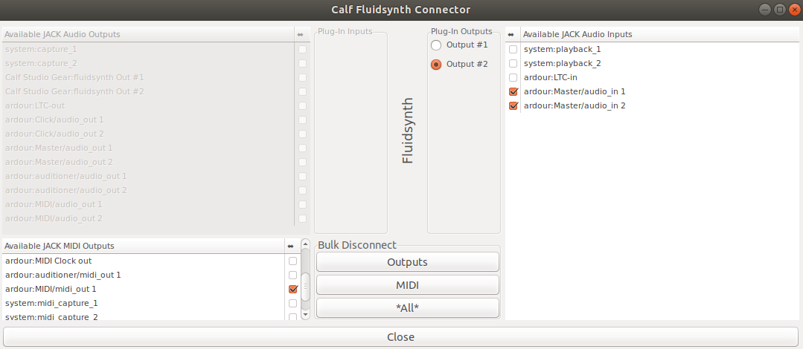

# linux-midi-setup
Discription of a working MIDI-powered recording setup on linux

## Hardware
- Taktile Korg USB connected

## Software
- Ardour5 
- Calf Plugin

- Ubuntu 17.10

## Setup

- Install above
- Run calfjackhost as root
- Add fluidsynth
- Import FluidR3_GM.sf2 soundfont
- Edit and set Channel number 9
- Start Ardour as root
- Start with JACK
- Add MIDI instrument (calf fluidsynth)
- Configure MIDI in Ardour

- Configure MIDI on calfjackhost

